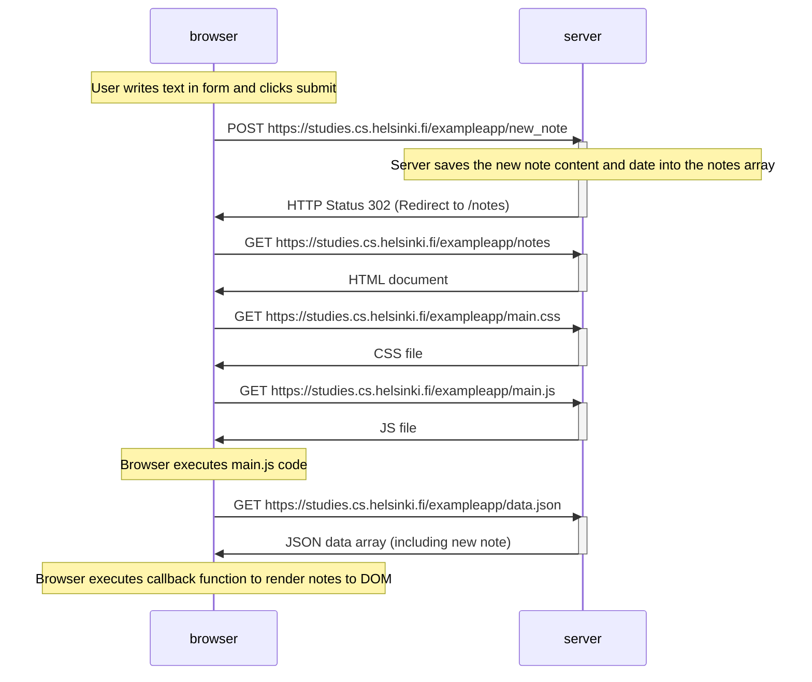

```mermaid
sequenceDiagram
    participant browser
    participant server

    Note over browser: User writes text in form and clicks submit

    browser->>server: POST https://studies.cs.helsinki.fi/exampleapp/new_note
    activate server
    Note over server: Server saves the new note content and date into the notes array
    server->>browser: HTTP Status 302 (Redirect to /notes)
    deactivate server

    browser->>server: GET https://studies.cs.helsinki.fi/exampleapp/notes
    activate server
    server->>browser: HTML document
    deactivate server

    browser->>server: GET https://studies.cs.helsinki.fi/exampleapp/main.css
    activate server
    server->>browser: CSS file
    deactivate server

    browser->>server: GET https://studies.cs.helsinki.fi/exampleapp/main.js
    activate server
    server->>browser: JS file
    deactivate server

    Note over browser: Browser executes main.js code

    browser->>server: GET https://studies.cs.helsinki.fi/exampleapp/data.json
    activate server
    server->>browser: JSON data array (including new note)
    deactivate server

    Note over browser: Browser executes callback function to render notes to DOM
```
