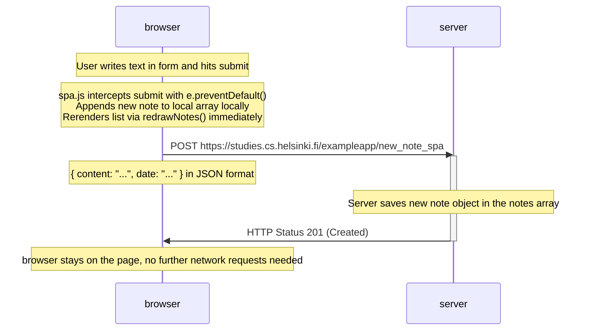

```mermaid
sequenceDiagram
    participant browser
    participant server

    Note over browser: User writes text in form and hits submit
    
    Note over browser: spa.js intercepts submit with e.preventDefault()<br/>Appends new note to local array locally<br/>Rerenders list via redrawNotes() immediately

    browser->>server: POST https://studies.cs.helsinki.fi/exampleapp/new_note_spa
    activate server
    Note over browser: { content: "...", date: "..." } in JSON format
    Note over server: Server saves new note object in the notes array
    server->>browser: HTTP Status 201 (Created)
    deactivate server

    Note over browser: browser stays on the page, no further network requests needed
```
